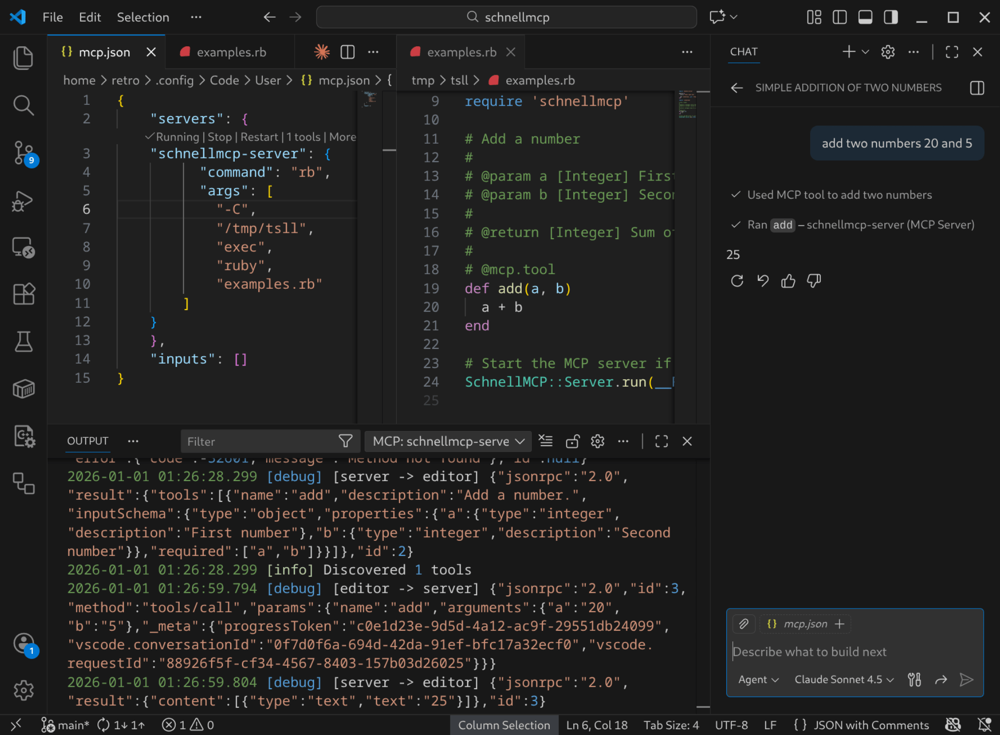

# SchnellMCP

Fast MCP server builder for Ruby using YARD annotations. Any method annotated with `@mcp.tool` is exposed as MCP tool. More YARD documentation added, the better tool description is. Finally reason to not delete all the LLM agentic generated method annotations!

## Quickstart

```ruby
require 'bundler/inline'

gemfile do
  source 'https://gem.coop'

  gem 'schnellmcp', git: 'https://github.com/RubyElders/schnellmcp'
end 

require 'schnellmcp'

# Add a number
#
# @param a [Integer] First number
# @param b [Integer] Second number
#
# @return [Integer] Sum of a and b
#
# @mcp.tool
def add(a, b)
  a + b
end

# Start the MCP server if called directly
SchnellMCP::Server.run(__FILE__) if __FILE__ == $0
```

Store as a `mcp.rb`.

Send JSON-RPC requests via stdin for quick test:

```bash
echo '{"jsonrpc":"2.0","id":1,"method":"tools/call","params":{"name":"add","arguments":{"a":5,"b":3}}}' | ruby mcp.rb
```

## VSCode Integration

add to `.vscode/mcp.json` or `Ctrl+Shift+P` -> `MCP: Open user configuration`:

```json
{
  "servers": {	
    "schnellmcp-server": {
      "command": "ruby",
      "args": [
        "/path/to/mcp.rb"
      ]
    }
  }
}	
```

Start and use your tools in Copilot Chat.


